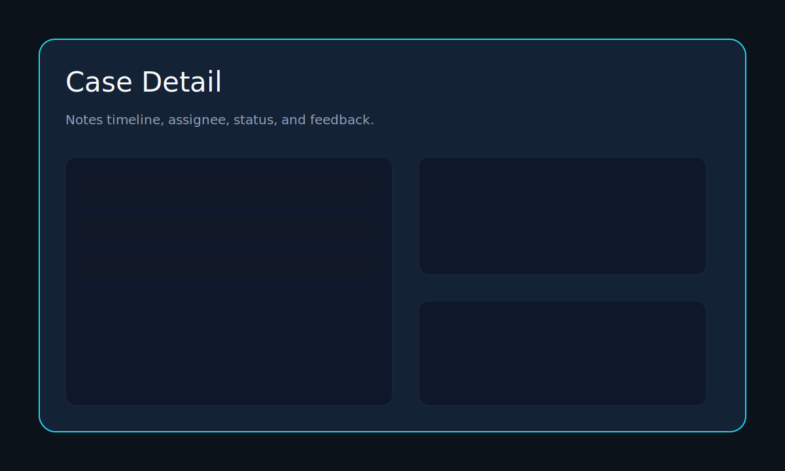
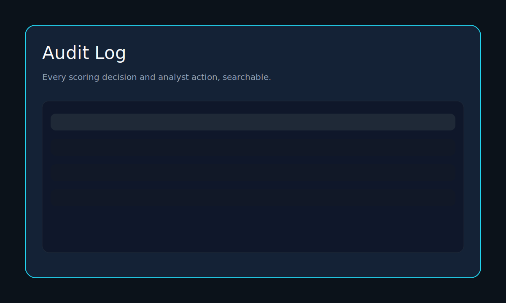

# Online Fraud Detection Platform

Portfolio-grade fraud operations console with a Vercel-native Next.js UI, FastAPI backend, and Postgres persistence.

## 30-second overview

- **Web:** Next.js App Router UI (`/web`) with alerts, review queue, cases, and audit log.
- **API:** FastAPI (`/backend`) with JWT auth + RBAC and audit logging.
- **Database:** Postgres for alerts, cases, audit_log, feedback, users, and rules.

```
[Web (Next.js)] -> /api/proxy -> [FastAPI] -> [Postgres]
```

## One-command local run

```bash
docker compose up --build
```

Services:
- Web UI: http://localhost:5173
- API: http://localhost:8001
- Postgres: localhost:5433

The backend runs migrations on startup and seeds demo data by default. Set `SEED_DEMO_DATA=false` to disable.

## Lite mode (8GB machines)

Start only the core stack:

```bash
docker compose up -d web backend db
```

Enable monitoring when needed:

```bash
docker compose --profile monitoring up -d
```

## Dataset upload (large CSV)

Set `NEXT_PUBLIC_API_BASE_URL` to your FastAPI base URL (used by the `/dataset` page for direct uploads):

```bash
NEXT_PUBLIC_API_BASE_URL=http://localhost:8001
```

Test the upload flow:
1. Start the stack with `docker compose up --build`.
2. Sign in at http://localhost:5173/login.
3. Upload a CSV at http://localhost:5173/dataset.
4. Files persist on the host at `backend/data/uploads` (container path: `/app/data/uploads`).
5. Optional: confirm persistence via `GET http://localhost:8001/datasets` (requires analyst/admin auth).


## Public demo (read-only, no login required)

Enable a public, read-only demo mode by setting:

```bash
DEMO_PUBLIC_READONLY=true
NEXT_PUBLIC_DEMO_PUBLIC_READONLY=true
```

When enabled, unauthenticated users can access read-only pages/endpoints
(`/dataset`, `/alerts`, `/audit`, `/security`, `/health`, `/metrics`, `/docs`).
All write requests (POST/PUT/PATCH/DELETE) return `403` with `DEMO_READ_ONLY`.
Leave both flags unset/false for normal authenticated mode.

## Core workflow

1. Score a transaction via `/score`.
2. Alert appears in **Alerts** and **Review Queue**.
3. Create a case from the alert.
4. Add notes + update status.
5. Submit feedback and confirm audit entry.

## Screenshots






## Repo layout

- `web/` Next.js App Router UI
- `backend/` FastAPI service + SQLAlchemy + Alembic
- `legacy/` Streamlit demos and old data (not used in production)

## Monitoring Setup (Grafana + Prometheus)

1) Prometheus is reachable at http://127.0.0.1:9090
2) Grafana is reachable at http://127.0.0.1:3000 (container fraud-grafana)
3) Set the Grafana Prometheus datasource URL to http://host.docker.internal:9090
4) Import dashboard:
   Dashboards -> Import -> upload `grafana/dashboards/fraud_ai_model_training_dashboard.UI.json`
   Map `DS_PROMETHEUS` to the Prometheus datasource.
5) Streamlit env vars and run command (Windows PowerShell):

```powershell
$env:GRAFANA_URL="http://127.0.0.1:3000"
$env:GRAFANA_DASH_UID="fraud-ai-training"
$env:GRAFANA_ORG_ID="1"
$env:GRAFANA_THEME="dark"
$env:PROM_URL="http://127.0.0.1:9090"
streamlit run legacy/fraud_lab/dashboard_app.py --server.port 8502
```

Helper scripts:
- `scripts/make_dashboard_ui.ps1` regenerates the UI-importable dashboard JSON.
- `scripts/verify_monitoring.ps1` runs conversion + local health checks.

Troubleshooting:
- "Panel id not found" means the dashboard UID or panel IDs do not match; re-import the UI.json.
- "No data" means Prometheus is not returning metrics; run `up` in Grafana Explore and check Prometheus targets.

## Backend features

- JWT auth + RBAC (ADMIN / ANALYST / VIEWER)
- Alert triage + bulk updates
- Case management with notes timeline
- Feedback loop + audit log entries
- Request ID + structured JSON logs
- Rate limiting on `/auth/login` and `/score` (in-memory; use Redis in production)
- `/health` and `/ready` endpoints

## ML scoring

- Offline training: `python backend/ml/train.py`
- Runtime scoring: `backend/ml/scorer.py` loads a versioned artifact

## Deployment guide

1. **Backend**
   - Deploy `backend/` as a FastAPI/ASGI service (Vercel, Railway, Fly.io).
   - Set env vars from `.env.example`.
   - Disable seeding in production with `SEED_DEMO_DATA=false`.
2. **Web**
   - Deploy `web/` as a Next.js app on Vercel.
   - Set `API_BASE` to your backend URL (proxy target).
   - Set `NEXT_PUBLIC_API_BASE_URL` for direct dataset uploads from the browser.

## Tests + CI

- Backend: `pytest`
- Web: `npm run lint`, `npm run typecheck`, `npm run build`
- CI workflow: `.github/workflows/ci.yml`

## Troubleshooting

- **Login fails:** ensure demo users exist (seed script in backend).
- **API 401 errors:** verify browser has `session` cookie set.
- **DB errors:** check Postgres container health and `DATABASE_URL`.
